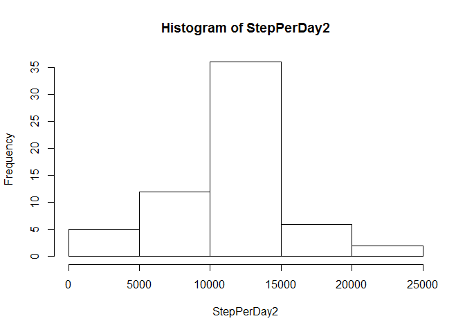

# Reproducible Research: Peer Assessment 1


## Loading and preprocessing the data


```r
library(stats)
getwd()
```

```
## [1] "C:/Users/Pascal/Documents/data/reproducibleresearch/RepData_PeerAssessment1"
```

```r
df<-read.csv(file="activity.csv")
```


## What is mean total number of steps taken per day?
1. Total number of steps taken per day

```r
df1<-na.omit(df)
StepPerDay<-aggregate(df1$steps,by=list(factor(df1$date)),sum)
names(StepPerDay)<-c("Date","Steps")
StepPerDay
```

```
##          Date Steps
## 1  2012-10-02   126
## 2  2012-10-03 11352
## 3  2012-10-04 12116
## 4  2012-10-05 13294
## 5  2012-10-06 15420
## 6  2012-10-07 11015
## 7  2012-10-09 12811
## 8  2012-10-10  9900
## 9  2012-10-11 10304
## 10 2012-10-12 17382
## 11 2012-10-13 12426
## 12 2012-10-14 15098
## 13 2012-10-15 10139
## 14 2012-10-16 15084
## 15 2012-10-17 13452
## 16 2012-10-18 10056
## 17 2012-10-19 11829
## 18 2012-10-20 10395
## 19 2012-10-21  8821
## 20 2012-10-22 13460
## 21 2012-10-23  8918
## 22 2012-10-24  8355
## 23 2012-10-25  2492
## 24 2012-10-26  6778
## 25 2012-10-27 10119
## 26 2012-10-28 11458
## 27 2012-10-29  5018
## 28 2012-10-30  9819
## 29 2012-10-31 15414
## 30 2012-11-02 10600
## 31 2012-11-03 10571
## 32 2012-11-05 10439
## 33 2012-11-06  8334
## 34 2012-11-07 12883
## 35 2012-11-08  3219
## 36 2012-11-11 12608
## 37 2012-11-12 10765
## 38 2012-11-13  7336
## 39 2012-11-15    41
## 40 2012-11-16  5441
## 41 2012-11-17 14339
## 42 2012-11-18 15110
## 43 2012-11-19  8841
## 44 2012-11-20  4472
## 45 2012-11-21 12787
## 46 2012-11-22 20427
## 47 2012-11-23 21194
## 48 2012-11-24 14478
## 49 2012-11-25 11834
## 50 2012-11-26 11162
## 51 2012-11-27 13646
## 52 2012-11-28 10183
## 53 2012-11-29  7047
```


2. Histogram of the total number of steps taken each day

```r
hist(StepPerDay$Steps)
```

<!-- -->

3. Mean and median of the total number of steps taken per day

```r
summary(StepPerDay$Steps)[3:4]
```

```
## Median   Mean 
##  10760  10770
```


## What is the average daily activity pattern?
1. Time series plot of the 5-minutes interval and the average number of steps taken, averaged across all days


```r
df1$timeinterval<-rep(1:288,53)
avgStep<-tapply(df1$steps,list(df1$timeinterval),mean)
plot(avgStep,type="l")
```

<!-- -->

2. 5-minute interval containing the maximum number of steps

The 104th 5-minute interval contains the maximum number of steps

```r
avgStep[avgStep==max(avgStep)]
```

```
##      104 
## 206.1698
```


## Imputing missing values

1. Number of rows, which is NA

```r
NROW(df[is.na(df),])
```

```
## [1] 2304
```

There are 8 days where the rows are NA. These days are:

```r
levels(factor(df[is.na(df),]$date))
```

```
## [1] "2012-10-01" "2012-10-08" "2012-11-01" "2012-11-04" "2012-11-09"
## [6] "2012-11-10" "2012-11-14" "2012-11-30"
```


2. Strategy for filling in all of the missing values in the dataset

We will replace the NA value with the 5-minutes interval average number of steps taken, averaged across all days.

3. Create a new data set that is equal to the original dataset but with the missing data filled in
We create the df2 dataset.

```r
df2<-df
df2[df2$date %in% levels(factor(df2[is.na(df),]$date)),]$steps<-rep(avgStep,8)
```

4. Histogram of the total number of steps taken each day. Means and median.
Histogram


```r
StepPerDay2<-tapply(df2$steps,df2$date,sum)

hist(StepPerDay2)
```

<!-- -->
Means and Median

```r
summary(StepPerDay2)[3:4]
```

```
## Median   Mean 
##  10770  10770
```


## Are there differences in activity patterns between weekdays and weekends?

1. Newfactor variable indicating whether a given date is a weekday or a weekdate

The new variable is daytype


```r
df2$weekday<-weekdays(as.Date(df2$date))
df2$daytype<-"weekday"
df2[df2$weekday == "Sunday" | df2$weekday == "Saturday",]$daytype<-"weekend"
df2$daytype<-as.factor(df2$daytype)
```

2. Panel plot comparing the number of steps weekday and weekend


```r
df2$timeinterval<-rep(1:288,61)
df2weekend<-df2[df2$daytype=="weekend",]
df2weekday<-df2[df2$daytype=="weekday",]
avgStepWeekEnd<-tapply(df2weekend$steps,list(df2weekend$timeinterval),mean)
avgStepWeekDay<-tapply(df2weekday$steps,list(df2weekday$timeinterval),mean)
rng<-range(avgStepWeekDay,avgStepWeekEnd)
par(mfrow=c(2,1))
plot(avgStepWeekEnd,type="l",col="green",ylim=rng)
plot(avgStepWeekDay,type="l",col="red",ylim=rng)
```

<!-- -->


